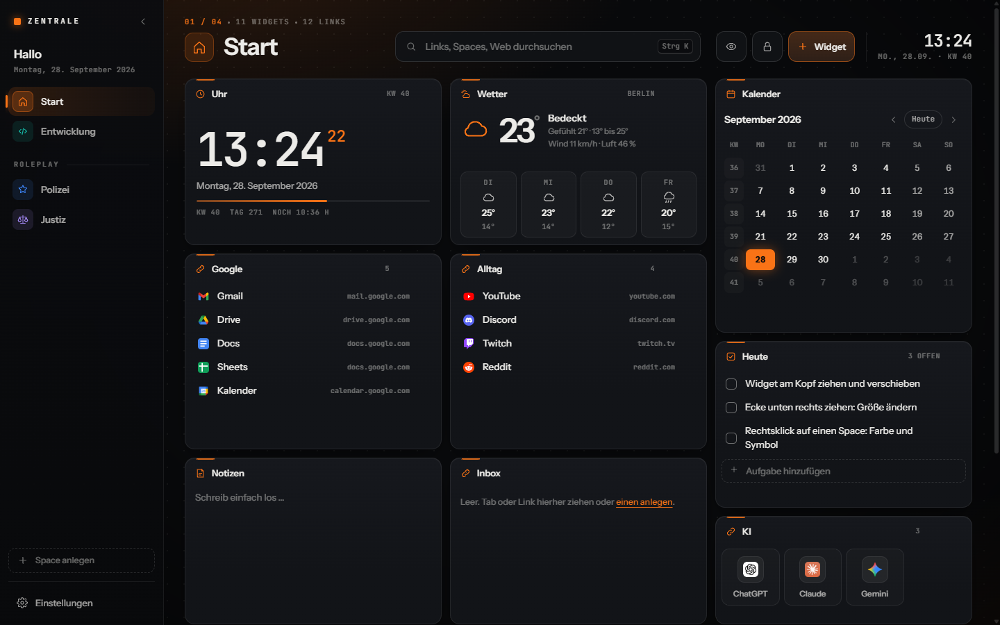
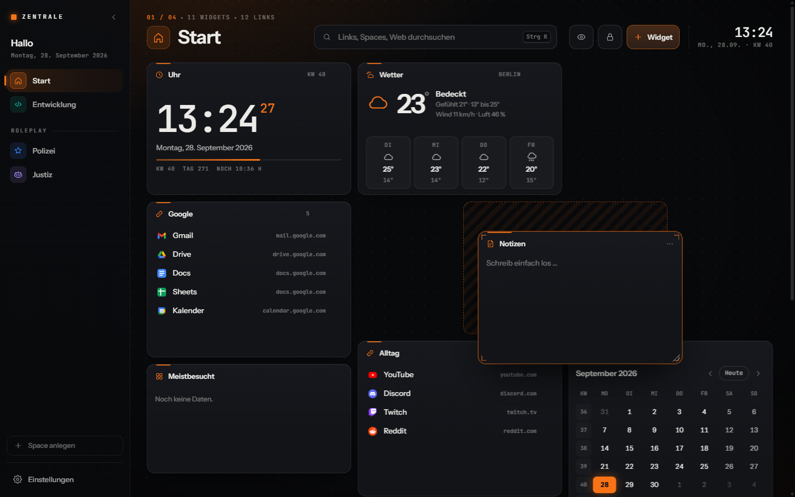
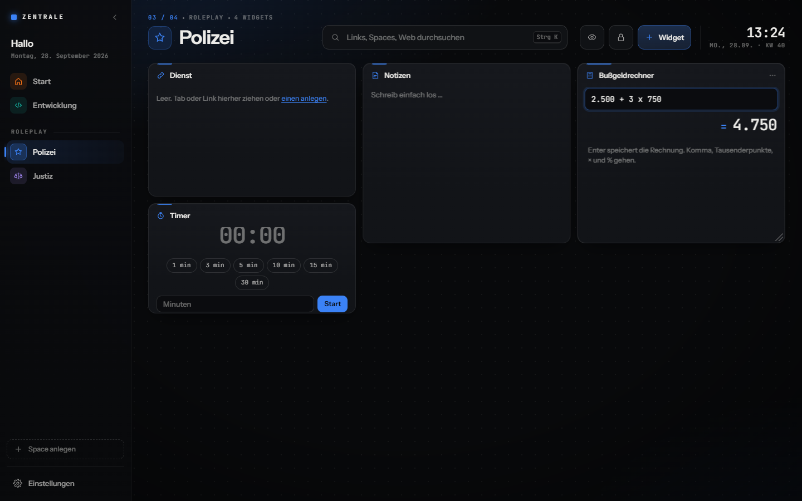
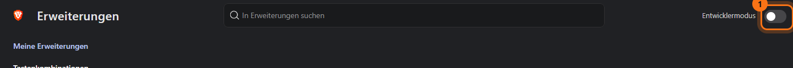
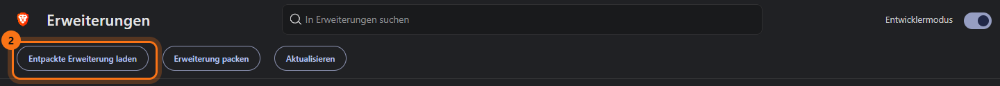
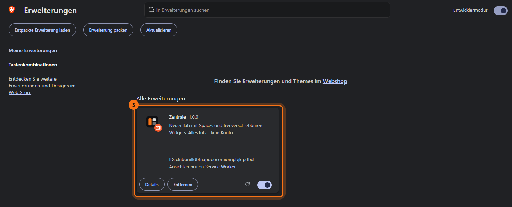
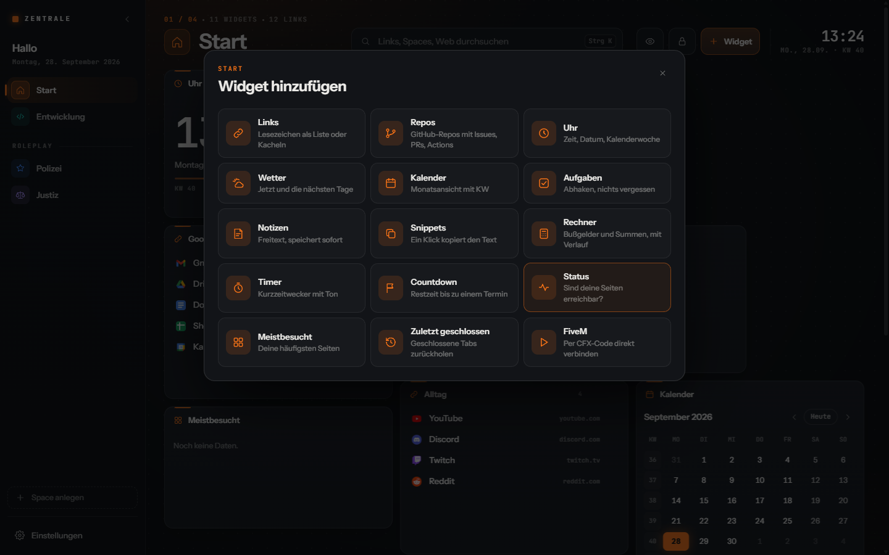
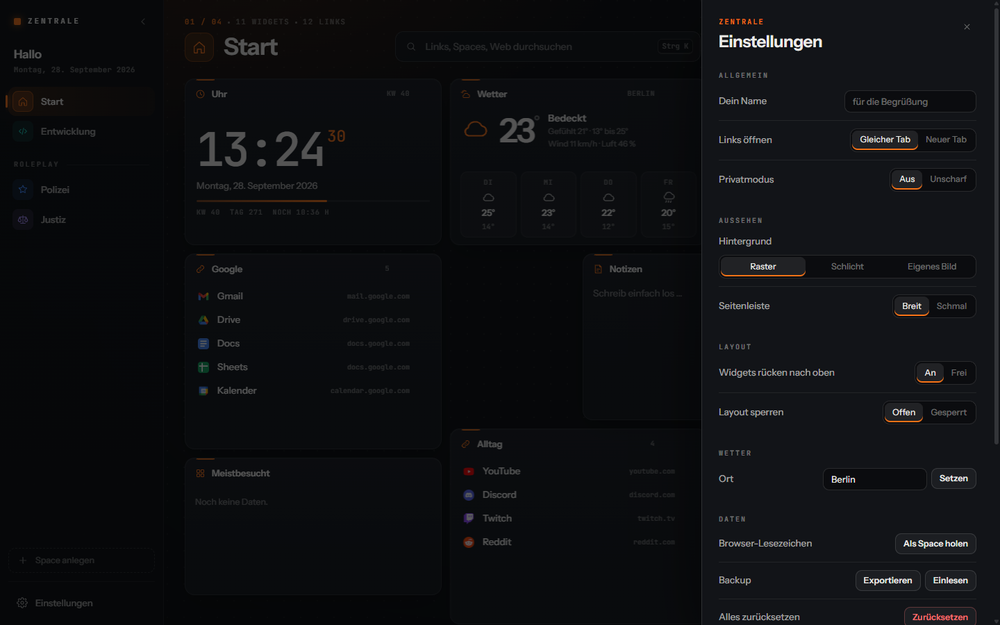

<p align="center">
  
</p>

<h1 align="center">Zentrale</h1>

<p align="center">
  Ein neuer Tab für Brave, Chrome und Edge.<br>
  Spaces in der Seitenleiste, Widgets frei verschiebbar, alles bleibt auf deinem Rechner.
</p>



## Was kann die Zentrale?

- **Spaces** in der linken Leiste, zum Beispiel „Start“, „Arbeit“ oder „Polizei“. Jeder Space hat eigene Widgets, eine eigene Farbe und ein eigenes Symbol. Spaces lassen sich in Gruppen zusammenfassen (im Beispiel „Roleplay“).
- **Widgets frei anordnen:** am Kopf ziehen zum Verschieben, an der Ecke unten rechts ziehen für die Größe. Die anderen Widgets machen automatisch Platz.
- **15 Widgets:** Links, GitHub-Repos, Uhr, Wetter, Kalender, Aufgaben, Notizen, Snippets, Rechner, Timer, Countdown, Status-Check, Meistbesucht, Zuletzt geschlossen, FiveM-Connect.
- **Suche** über alle Links und Spaces mit `Strg + K`, oder direkt bei Google.
- **Privatmodus**, der Linknamen und Notizen unscharf macht, zum Beispiel beim Streamen.
- **Backup** als JSON-Datei, Import deiner Browser-Lesezeichen.
- **Kein Konto, kein Server, keine Tracker.** Alles liegt im Speicher deines Browsers.

| Widget verschieben | Roleplay-Space mit Bußgeldrechner |
|---|---|
|  |  |

---

## Installation

Die Zentrale ist (noch) nicht im Chrome Web Store. Du lädst sie deshalb einmal als „entpackte Erweiterung“. Das dauert etwa zwei Minuten und funktioniert in **Brave, Google Chrome, Microsoft Edge, Opera und Vivaldi**. Firefox wird nicht unterstützt.

### Schritt 1: Dateien herunterladen

1. Oben auf dieser Seite auf den grünen Knopf **Code** klicken, dann **Download ZIP**.
2. Die ZIP-Datei entpacken, zum Beispiel nach `Dokumente\zentrale`.
3. Den Ordner an einem festen Platz lassen. Der Browser lädt die Erweiterung direkt aus diesem Ordner. Wenn du ihn später löschst oder verschiebst, ist die Zentrale weg.

Wer Git nutzt, kann stattdessen klonen:

```bash
git clone https://github.com/EinfachFelix1301/zentrale.git
```

Im Ordner liegen jetzt unter anderem `docs` und `extension`. Gebraucht wird nur **`extension`**.

Noch einfacher: Unter [Releases](https://github.com/EinfachFelix1301/zentrale/releases/latest) die Datei `zentrale-x.y.z.zip` laden. Sie enthält nur die Erweiterung. Nach dem Entpacken wählst du in Schritt 4 direkt den Ordner `zentrale`.

### Schritt 2: Erweiterungsseite öffnen

Diese Adresse in die Adressleiste tippen und Enter drücken:

| Browser | Adresse |
|---|---|
| Brave | `brave://extensions` |
| Google Chrome | `chrome://extensions` |
| Microsoft Edge | `edge://extensions` |
| Opera | `opera://extensions` |
| Vivaldi | `vivaldi://extensions` |

### Schritt 3: Entwicklermodus einschalten

Oben rechts den Schalter **Entwicklermodus** einschalten. In Edge steht er links unten in der Seitenleiste.



### Schritt 4: Erweiterung laden

1. Auf **Entpackte Erweiterung laden** klicken.
2. Im Fenster, das sich öffnet, den Ordner **`extension`** auswählen, nicht den Hauptordner `zentrale`.
3. Auf **Ordner auswählen** klicken.



Wenn der Browser meldet, dass die Manifest-Datei fehlt, war es der falsche Ordner. Nimm den Ordner, in dem die Datei `manifest.json` liegt.

### Schritt 5: Fertig

Die Zentrale steht jetzt in der Liste und ist eingeschaltet.



Mit `Strg + T` einen neuen Tab öffnen. Chrome und Edge fragen beim ersten Mal, ob die Änderung durch die Erweiterung gewollt ist. Dort **Änderungen beibehalten** wählen.

### Optional: Zentrale auch beim Browserstart

Normalerweise zeigt der Browser beim Start deine letzten Tabs. Wenn stattdessen die Zentrale kommen soll:

- **Brave:** Einstellungen → *Erste Schritte* → *Beim Start* → **Neuen Tab öffnen**
- **Chrome:** Einstellungen → *Beim Start* → **Neuen Tab öffnen**
- **Edge:** Einstellungen → *Start, Startseite und neue Tabs* → **Neue Registerkarte öffnen**

---

## Bedienung

| Was | Wie |
|---|---|
| Space wechseln | Klick in der linken Leiste oder Taste `1` bis `9` |
| Suchen | `/` oder `Strg + K`. Enter öffnet, `Alt + Enter` sucht bei Google |
| Widget verschieben | Am Kopf des Widgets ziehen |
| Widget in anderen Space | Am Kopf ziehen und auf einen Space in der Leiste fallen lassen |
| Größe ändern | Ecke unten rechts ziehen |
| Widget hinzufügen | Knopf **Widget** oben rechts oder Taste `N` |
| Widget-Optionen | Die drei Punkte im Widget-Kopf oder Rechtsklick auf den Kopf |
| Umbenennen | Doppelklick auf einen Titel |
| Space anpassen | Rechtsklick auf den Space: Farbe, Symbol, Gruppe, Reihenfolge |
| Link hinzufügen | `+` im Links-Widget, oder einen Tab bzw. Link hineinziehen |
| Aktuellen Tab merken | `Strg + Shift + B` oder Rechtsklick auf eine Seite → *In die Zentrale-Inbox legen* |
| Layout sperren | Schloss-Knopf oder Taste `L` |
| Privatmodus | Augen-Knopf oder Taste `P` |



### Die Widgets

| Widget | Wofür |
|---|---|
| Links | Lesezeichen als Liste oder Kacheln. Über das Menü lassen sich alle auf einmal öffnen. |
| Repos | GitHub-Repositories mit direkten Links zu Issues, Pull Requests und Actions |
| Uhr | Uhrzeit, Datum, Kalenderwoche, Tagesfortschritt |
| Wetter | Aktuelles Wetter und vier Tage Vorschau. Den Ort stellst du in den Einstellungen ein. |
| Kalender | Monatsansicht mit Kalenderwochen |
| Aufgaben | Abhaken und erledigte entfernen |
| Notizen | Freitext, wird beim Tippen gespeichert |
| Snippets | Texte, die du oft brauchst. Ein Klick kopiert sie. |
| Rechner | Versteht deutsche Schreibweise, z. B. `2.500 + 3 x 750` oder `1,5 * 20 %`. Mit Verlauf. |
| Timer | Kurzzeitwecker mit Ton |
| Countdown | Restzeit bis zu einem Termin |
| Status | Prüft jede Minute, ob deine Seiten erreichbar sind |
| Meistbesucht | Deine am häufigsten besuchten Seiten |
| Zuletzt geschlossen | Versehentlich geschlossene Tabs mit einem Klick zurückholen |
| FiveM | Mit einem CFX-Code direkt auf einen Server verbinden |

## Einstellungen und Backup

Unten links auf **Einstellungen**. Dort stellst du deinen Namen für die Begrüßung, den Hintergrund (Raster, schlicht oder ein eigenes Bild), den Wetter-Ort und das Verhalten beim Öffnen von Links ein.



Unter **Daten**:

- **Exportieren** speichert alles als JSON-Datei. Mach das ab und zu, und immer vor einem Browser-Wechsel.
- **Einlesen** holt so ein Backup zurück, auch auf einem anderen Rechner.
- **Als Space holen** übernimmt deine Browser-Lesezeichen als neuen Space.

Beim ersten Start siehst du Beispiel-Spaces. Die kannst du umbauen oder per Rechtsklick → *Space löschen* entfernen.

## Aktualisieren

1. Neue Version herunterladen und die Dateien in **denselben** Ordner entpacken, die alten überschreiben. Mit Git reicht `git pull`.
2. Auf der Erweiterungsseite bei der Zentrale auf den runden Pfeil klicken.

Deine Daten bleiben erhalten, solange der Ordner am selben Ort liegt. Der Browser ordnet die Daten dem Ordnerpfad zu. Wer den Ordner verschieben will, exportiert vorher ein Backup und liest es danach wieder ein.

## Häufige Probleme

**Der neue Tab zeigt nicht die Zentrale.**
Prüfe auf der Erweiterungsseite, ob der Schalter der Zentrale an ist. Eine andere Erweiterung, die auch den neuen Tab ersetzt, muss ausgeschaltet werden, denn es kann nur eine gewinnen.

**„Manifest-Datei fehlt oder ist nicht lesbar“.**
Du hast den Hauptordner gewählt. Wähle den Unterordner `extension`.

**Chrome zeigt beim Start eine Warnung zu Entwickler-Erweiterungen.**
Das ist bei entpackten Erweiterungen normal. Einfach wegklicken, die Zentrale bleibt aktiv.

**Das Wetter lädt nicht.**
In den Einstellungen einen Ort eintragen und auf *Setzen* klicken. Das Wetter kommt von [Open-Meteo](https://open-meteo.com), dafür braucht es eine Internetverbindung.

## Datenschutz

Alle Spaces, Links, Notizen und Einstellungen liegen im lokalen Speicher deines Browsers (`chrome.storage.local`). Es gibt keinen Server und kein Konto, und die Zentrale sammelt keine Daten.

Die Zentrale verbindet sich nur mit:

- **Open-Meteo**, für das Wetter-Widget (nur der eingestellte Ort)
- **Google-Favicon-Dienst und den Seiten selbst**, für die kleinen Icons neben deinen Links
- **den Seiten im Status-Widget**, um zu prüfen, ob sie erreichbar sind

### Wofür die Berechtigungen sind

| Berechtigung | Grund |
|---|---|
| `storage`, `unlimitedStorage` | Deine Daten speichern, auch ein eigenes Hintergrundbild |
| `bookmarks` | Lesezeichen als Space übernehmen (nur wenn du es auslöst) |
| `topSites` | Widget „Meistbesucht“ |
| `sessions` | Widget „Zuletzt geschlossen“ |
| `tabs` | Links in neuen Tabs öffnen |
| `contextMenus` | Rechtsklick-Eintrag „In die Zentrale-Inbox legen“ |

## Mitmachen

Fehler gefunden oder eine Idee für ein Widget? Einfach ein [Issue](https://github.com/EinfachFelix1301/zentrale/issues) aufmachen. Pull Requests sind willkommen.

Aufbau: Die Erweiterung liegt komplett in `extension/`, ohne Build-Schritt und ohne Abhängigkeiten. `newtab.html`, `newtab.css` und `newtab.js` sind der neue Tab, `background.js` kümmert sich um das Rechtsklick-Menü und das Tastenkürzel. Nach einer Änderung auf der Erweiterungsseite den runden Pfeil klicken und einen neuen Tab öffnen.

## Lizenz

[MIT](LICENSE). Die Schriften *Instrument Sans* und *JetBrains Mono* stehen unter der SIL Open Font License (siehe `extension/fonts/`).
